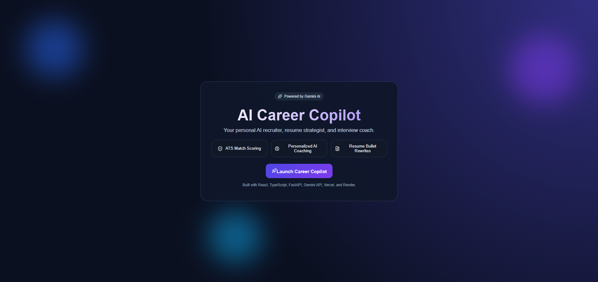
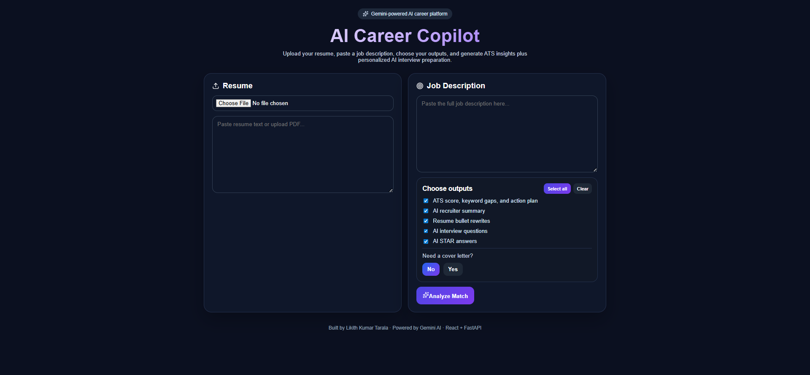
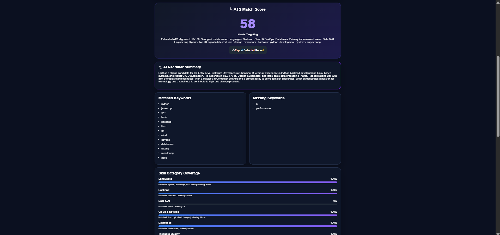
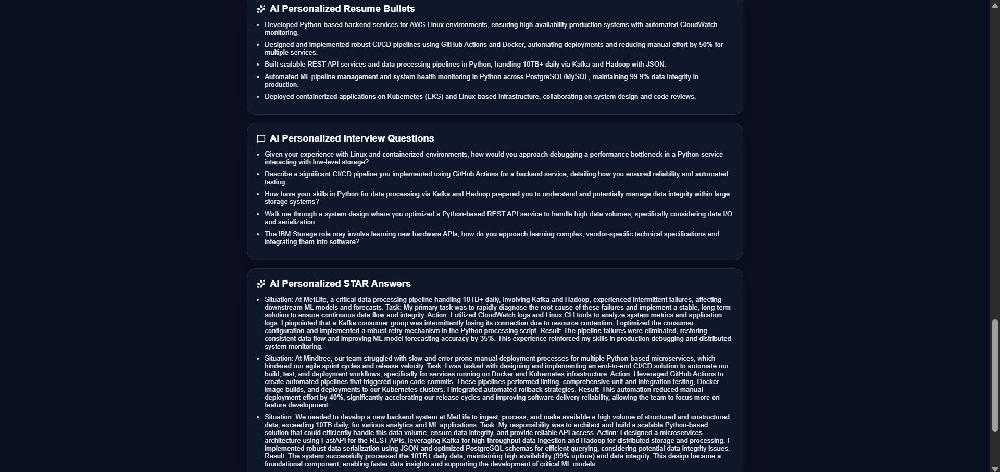
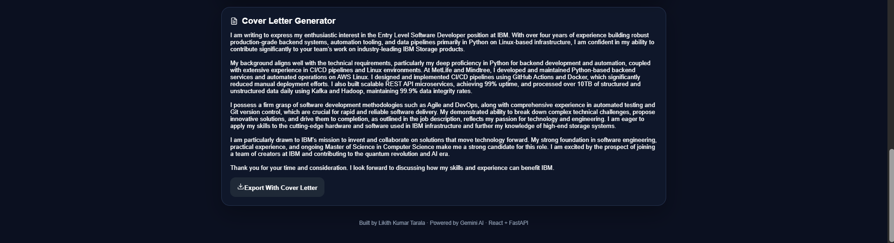

# AI Career Copilot

AI-powered career optimization platform that helps candidates improve resumes, prepare for interviews, generate cover letters, and maximize ATS match scores.

## Live Demo

https://ai-career-copilot-kappa.vercel.app

---

## Features

- Resume PDF Upload + Parsing
- ATS Match Score
- Keyword Gap Detection
- Skill Category Coverage
- AI Recruiter Summary
- Personalized Resume Bullet Rewrites
- AI Interview Questions
- AI STAR Answers
- AI Cover Letter Generator
- Export Report
- Premium Animated UI

---

## Screenshots

### Landing Page

### Main Input Screen

### ATS Results

### AI Outputs

### Cover Letter

---

## Tech Stack

### Frontend
- React
- TypeScript
- Vite
- CSS
- Lucide Icons

### Backend
- FastAPI
- Python

### AI
- Google Gemini API

### Deployment
- Vercel
- Render

---

## How It Works

1. Upload resume or paste resume text
2. Paste target job description
3. Choose desired outputs
4. Analyze ATS fit
5. Generate AI coaching outputs
6. Export final report

---

## Why I Built This

Hiring is difficult for many candidates. I built AI Career Copilot as a practical AI product that helps job seekers improve applications with personalized, real-time guidance.

---

## Future Improvements

- Saved user dashboard
- Resume history tracking
- Chrome extension for job sites
- LinkedIn optimization
- Mock interview mode

---

## Author

Likith 